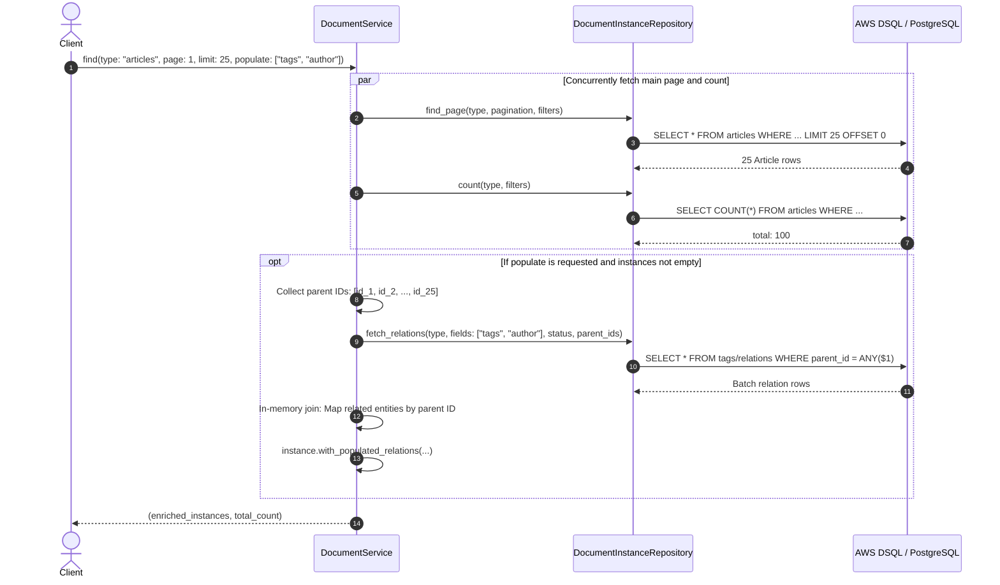

# Research: Strapi 5 REST API, Populate Semantics & Batch Join Enrichment

- **Date**: 2026-09-23
- **Question**: How does Strapi 5 handle relations, `populate`, and nested documents in its REST API, and how can we implement high-performance relation joins using batch loading and in-memory enrichment in Luminair's Application layer?
- **Related ADRs**:
  - [ADR-003 — Relation Representation](../adr/ADR-003-bidirectional-relations.md)
  - [ADR-007 — Persistence Model](../adr/ADR-007-persistence-model.md)
  - [Research: Application Layer Design](./application-layer-design.md)

---

## 1. Strapi 5 REST API & Document Service Specification

Strapi 5 introduced major architectural evolutions over Strapi v4:
1. **Flattened Response Structure**: The v4 `data.attributes` nesting was removed. Attributes and IDs exist directly at the top level of the item object:
   ```json
   {
     "data": [
       {
         "id": "01932c4a-...",
         "title": "Introduction to Rust",
         "slug": "intro-to-rust",
         "author": {
           "id": "01932c4b-...",
           "name": "Jane Doe"
         },
         "tags": [
           { "id": "01932c4c-...", "name": "Rust" },
           { "id": "01932c4d-...", "name": "Backend" }
         ]
       }
     ],
     "meta": {
       "pagination": {
         "page": 1,
         "pageSize": 25,
         "total": 100
       }
     }
   }
   ```
2. **`populate` Exclusion by Default**: By default, relations, components, and dynamic zones are **omitted** from GET responses to optimize database performance and payload size.
3. **Populate Parameters**:
   - **Wildcard (`*`)**: `GET /api/articles?populate=*` loads all 1-level-deep relations.
   - **List of attributes**: `GET /api/articles?populate[0]=author&populate[1]=tags` or `GET /api/articles?populate=author,tags`.
   - **Deep / Nested Populate**:
     - Field selection: `GET /api/articles?populate[author][fields][0]=name`
     - Nested relations: `GET /api/articles?populate[author][populate][profile]=*`
     - Relation filtering: `GET /api/articles?populate[comments][filters][approved][$eq]=true`
     - Relation sorting: `GET /api/articles?populate[comments][sort][0]=created_at:desc`
4. **Draft & Publish Status (`status`)**:
   - `status=published` (default for public access): Only published instances and published relations are returned.
   - `status=draft`: Returns current draft entries (including unpublished relations).

---

## 2. The Batch Join Enrichment Technique (Why Not SQL `LEFT JOIN`?)

In relational database systems and especially distributed SQL engines like **AWS Aurora DSQL** and **PostgreSQL**, naive SQL `LEFT JOIN`s suffer from severe limitations:

### The Pitfalls of SQL `LEFT JOIN` on Collections:
1. **Cartesian Product Multiplication**: Joining multiple `HasMany` relations (e.g. `articles LEFT JOIN tags LEFT JOIN comments`) multiplies row counts exponentially ($N \times M \times K$), overwhelming network bandwidth and memory.
2. **Broken SQL Pagination (`LIMIT` / `OFFSET`)**: In SQL, `LIMIT 25` applies to the *flattened joined rows*, NOT the parent entities. If an article has 10 tags, 25 rows may represent only 2.5 articles, breaking pagination guarantees.
3. **DSQL Distributed Transactions**: In Aurora DSQL, large multi-table distributed joins across independent shards incur substantial latency and contention.

### The 2-Phase Batch Enrichment Pattern:
Instead of a single complex SQL join, relation resolution is decoupled into two phases:



### Key Advantages of Batch Enrichment:
1. **Accurate Pagination**: `LIMIT` and `OFFSET` strictly apply to the main collection.
2. **Linear Time Complexity ($O(N + M)$)**: Relation queries run in bulk with `WHERE parent_id = ANY(...)` or IN clause; assembly uses hash lookups.
3. **Concurrency Optimization**: `find` and `count` execute concurrently via `tokio::try_join!`.
4. **Clean Domain Boundaries**: The repository handles pure data loading; the application service controls the composition and enrichment.

---

## 3. Adaptation to Luminair's Domain Model & Architecture

### 3.1. How `SchemaRegistry` Drives Relation Resolution

Per ADR-003 (Option F) and ADR-006:
- `DocumentType` has no inline relation metadata.
- `SchemaRegistry.find_relations_for(owner_type_id)` provides `RelationView`:
  - `OwnerSide { attr, kind, other_type }`
  - `InverseSide { attr, kind, other_type }`
  - `Unidirectional { attr, kind, target_type }`

When the application layer receives `populate: ["tags", "author"]`:
1. It validates against `SchemaRegistry` that `tags` and `author` are registered relations on the document type.
2. It resolves the target `DocumentTypeId` and `OwnerRelationKind` (`HasOne` vs `HasMany`).
3. It passes the validated relation metadata to `fetch_relations`.

---

### 3.2. Extending `DocumentInstance` in Domain for Populated Relations

Currently, `DocumentInstance` holds:
```rust
pub struct DocumentInstance {
    pub id: DocumentInstanceId,
    pub db_row_id: Option<DocumentInstanceId>,
    pub document_type_id: DocumentTypeId,
    pub content: DocumentContent,
    pub relations: HashMap<AttributeId, Vec<ResolvedRelation>>,
    pub audit: AuditTrail,
}
```
`relations` only holds `target_instance_id: DocumentInstanceId`.

To support rich populated relations (as demonstrated in the user's snippet), we add populated relation state to `DocumentInstance`:

```rust
#[derive(Debug, Clone, PartialEq, Eq, Serialize, Deserialize)]
pub struct DocumentInstance {
    pub id: DocumentInstanceId,
    pub db_row_id: Option<DocumentInstanceId>,
    pub document_type_id: DocumentTypeId,
    pub content: DocumentContent,
    pub relations: HashMap<AttributeId, Vec<ResolvedRelation>>,
    /// Populated relations attached by the application layer upon request
    pub populated_relations: HashMap<AttributeId, Vec<DocumentInstance>>,
    pub audit: AuditTrail,
}

impl DocumentInstance {
    /// Returns a new instance with attached populated relations.
    pub fn with_populated_relations(
        mut self,
        populated: HashMap<AttributeId, Vec<DocumentInstance>>,
    ) -> Self {
        self.populated_relations = populated;
        self
    }
}
```

---

### 3.3. Port Trait Enhancement: `DocumentInstanceRepository`

To support batch relation loading without N+1 queries, we add `fetch_relations` to `DocumentInstanceRepository`:

```rust
pub type RelationMap = HashMap<AttributeId, HashMap<DocumentInstanceId, Vec<DocumentInstance>>>;

#[async_trait]
pub trait DocumentInstanceRepository: Send + Sync {
    async fn find_by_id(
        &self,
        id: DocumentInstanceId,
    ) -> Result<Option<DocumentInstance>, DomainError>;

    async fn find_by_type(
        &self,
        type_id: DocumentTypeId,
        pagination: Pagination,
        filters: Vec<FieldFilter>,
    ) -> Result<Page<DocumentInstance>, DomainError>;

    async fn count(
        &self,
        type_id: DocumentTypeId,
        filters: Vec<FieldFilter>,
    ) -> Result<u64, DomainError>;

    /// Batch-loads relations for a set of parent instance IDs.
    /// Returns a nested map: AttributeId -> (ParentInstanceId -> Vec<RelatedInstance>)
    async fn fetch_relations(
        &self,
        type_id: DocumentTypeId,
        attributes: &[AttributeId],
        parent_ids: &[DocumentInstanceId],
    ) -> Result<RelationMap, DomainError>;

    async fn save(&self, instance: &DocumentInstance) -> Result<(), DomainError>;
    async fn delete(&self, id: DocumentInstanceId) -> Result<(), DomainError>;
    async fn exists_for_type(&self, type_id: DocumentTypeId) -> Result<bool, DomainError>;
}
```

---

## 4. Application Layer Implementation Design

### 4.1. Populate Specification Structs

```rust
#[derive(Debug, Clone, PartialEq, Eq)]
pub enum PopulateDirective {
    /// `populate=*` — populate all registered relations for this type (1 level deep)
    Wildcard,
    /// `populate[0]=tags&populate[1]=author` — populate specific relation attributes
    Attributes(Vec<AttributeId>),
    /// Empty / None — no relations populated (default)
    None,
}
```

### 4.2. `DocumentService::find` & `enrich` Implementation

```rust
impl DocumentService {
    pub async fn find(
        &self,
        caller: &CallerContext,
        cmd: FindDocumentsQuery,
    ) -> Result<Page<DocumentInstance>, ApplicationError> {
        let action = Permission::ReadDocument(Some(cmd.type_id));
        if !AuthorizationService::can(&caller.user_id, &action, None, &caller.roles) {
            return Err(ApplicationError::Unauthorized {
                user_id: caller.user_id.clone(),
                action,
            });
        }

        // Concurrently query page items and total count
        let (page_result, count_result) = tokio::try_join!(
            self.instance_repo.find_by_type(cmd.type_id, cmd.pagination, cmd.filters.clone()),
            self.instance_repo.count(cmd.type_id, cmd.filters),
        )?;

        // Enrich with populated relations if requested
        let enriched = self
            .enrich(cmd.type_id, cmd.populate, page_result.items)
            .await?;

        Ok(Page {
            items: enriched,
            total: count_result,
            page: cmd.pagination.page,
            page_size: cmd.pagination.page_size,
        })
    }

    pub async fn find_by_id(
        &self,
        caller: &CallerContext,
        cmd: FindByIdQuery,
    ) -> Result<Option<DocumentInstance>, ApplicationError> {
        let instance = match self.instance_repo.find_by_id(cmd.id).await? {
            Some(inst) => inst,
            None => return Ok(None),
        };

        let action = Permission::ReadDocument(Some(instance.document_type_id));
        if !AuthorizationService::can(&caller.user_id, &action, Some(&instance), &caller.roles) {
            return Err(ApplicationError::Unauthorized {
                user_id: caller.user_id.clone(),
                action,
            });
        }

        let enriched = self
            .enrich(instance.document_type_id, cmd.populate, vec![instance])
            .await?;

        Ok(enriched.into_iter().next())
    }

    /// Batch-load and attach relations to a set of document instances.
    async fn enrich(
        &self,
        type_id: DocumentTypeId,
        populate: PopulateDirective,
        instances: Vec<DocumentInstance>,
    ) -> Result<Vec<DocumentInstance>, ApplicationError> {
        if instances.is_empty() {
            return Ok(instances);
        }

        // Resolve requested attributes from SchemaRegistry
        let attributes: Vec<AttributeId> = match populate {
            PopulateDirective::None => return Ok(instances),
            PopulateDirective::Wildcard => {
                self.schema_registry
                    .find_relations_for(type_id)
                    .into_iter()
                    .map(|view| match view {
                        RelationView::OwnerSide { attr, .. }
                        | RelationView::InverseSide { attr, .. }
                        | RelationView::Unidirectional { attr, .. } => attr,
                    })
                    .collect()
            }
            PopulateDirective::Attributes(attrs) => attrs,
        };

        if attributes.is_empty() {
            return Ok(instances);
        }

        let parent_ids: Vec<DocumentInstanceId> = instances.iter().map(|d| d.id).collect();

        // Single batch roundtrip to load all related instances across the parent IDs
        let relation_map = self
            .instance_repo
            .fetch_relations(type_id, &attributes, &parent_ids)
            .await?;

        // In-memory enrichment: O(N) stitching
        let enriched = instances
            .into_iter()
            .map(|instance| {
                let mut per_doc = HashMap::new();
                for attr in &attributes {
                    if let Some(by_parent) = relation_map.get(attr) {
                        let related = by_parent.get(&instance.id).cloned().unwrap_or_default();
                        per_doc.insert(attr.clone(), related);
                    }
                }
                instance.with_populated_relations(per_doc)
            })
            .collect();

        Ok(enriched)
    }
}
```

---

## 5. Conclusions & Architectural Decisions

1. **Adopt Strapi 5 Flattened JSON Conventions**:
   - The REST API serializer will emit flattened document payloads without `data.attributes`.
   - Populated relations serialize as direct nested arrays/objects under the relation's `AttributeId`.
2. **Adopt the Batch Join Enrichment Pattern**:
   - Eliminates Cartesian products and N+1 query storms.
   - Preserves strict SQL `LIMIT` / `OFFSET` pagination semantics.
   - Executes `find` + `count` concurrently using `tokio::try_join!`.
3. **Domain Model & Port Updates**:
   - Add `populated_relations: HashMap<AttributeId, Vec<DocumentInstance>>` and `with_populated_relations` to `DocumentInstance`.
   - Add `count` and `fetch_relations` to `DocumentInstanceRepository` port trait.
   - Both in-memory fake repositories and SQLx persistence layer will implement `fetch_relations` cleanly.
