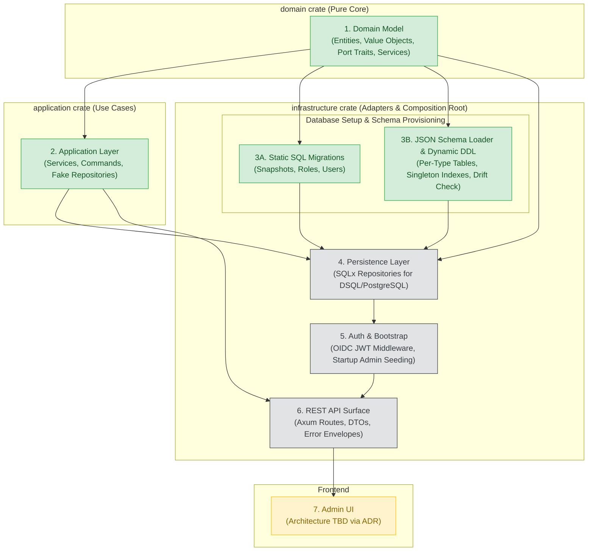

# Implementation Roadmap

This document outlines the end-to-end implementation plan for Luminair following the completion of the `domain` crate. It defines the sequence of milestones, layer boundaries, architectural dependencies, and testing strategies.

---

## Architecture & Dependency Flow

---

## Phase Breakdown

### Phase 1: Domain Crate (Completed ✅)
* **Scope**: All domain entities, value objects with `nutype`, pure domain services (`SchemaRegistry`, `AuthorizationService`), and async port traits (`Send + Sync`).
* **Deliverable**: `domain` crate with 64 passing unit tests, zero warnings.
* **Reference**: [`docs/plans/domain-model-implementation.md`](./plans/domain-model-implementation.md).

---

### Phase 2: Application Layer (Completed ✅)
* **Crate**: `application`
* **Objective**: Orchestrate business use cases, command and query handling, and transactional logic independently of databases or HTTP frameworks.
* **Key Components**:
  * **Document Workflows**:
    * `CreateDocumentCommand`: Validates input with `SchemaRegistry`, checks singleton constraint for `SingleType`, generates v7 UUID, saves via repository.
    * `UpdateDocumentCommand`: Bumps version and audit trail, validates fields.
    * `PublishDocumentCommand`: Advances revision, snapshots fields, records publication.
    * `UnpublishDocumentCommand`: Transitions document to draft state preserving last published revision.
    * `FindDocumentsCommand`, `FindByIdCommand`, `DeleteDocumentCommand`.
    * Two-phase batch relation enrichment (`enrich`) to avoid Cartesian explosion without N+1 queries.
  * **Access & Authorization Workflows**:
    * `SubmitAccessRequestCommand`: Creates pending request for OIDC user (blocks duplicate active requests).
    * `ApproveAccessRequestCommand`: Grants assigned roles, creates `UserRoleAssignment` records.
    * `RejectAccessRequestCommand`: Sets rejected status with audit notes.
    * Query and owner-authorized inspection methods.
  * **System Configuration**:
    * `SystemConfigService`: Read-only introspection of static system configuration (locales, default locale) loaded at startup.
* **Deliverable**: `application` crate with 35 tests (31 unit, 4 end-to-end workflow integration tests), zero warnings, RPITIT native async traits with zero heap allocation.

---

### Phase 3: Database Migrations & Schema Loader

Consists of two complementary mechanisms aligned with [ADR-006](./adr/ADR-006-schema-loading.md) and [ADR-007](./adr/ADR-007-persistence-model.md):

#### 3A. Static SQL Migrations (`infrastructure/migrations/`) — Complete
* **Objective**: Versioned schema for all non-dynamic system tables using `sqlx migrate`.
* **Tables**:
  * `document_snapshots`: Immutable JSONB revision store with unique `(instance_id, revision)`.
  * `roles`: Role definitions with unique `name`.
  * `role_permissions`: Permission grants with `NULLS NOT DISTINCT` constraint and `VARCHAR(64)` for kebab-case `document_type_id`.
  * `user_role_assignments`: OIDC `sub` (`user_id`) to role mapping.
  * `access_requests`: User onboarding queue with partial unique index for active requests.
  * `shadow_users`: Local cache of verified OIDC identities.
  *(Note: `system_config` table was eliminated in favor of immutable startup JSON, matching ADR-006).*
* **Seed Data**: Built-in `admin`, `editor`, and `viewer` roles with deterministic UUID v7 identifiers.
* **Compatibility**: Zero sequences/serial columns, all migration files start with `-- no-transaction` for AWS DSQL.
* **Deliverable**: `MIGRATOR` embedded runner, deterministic role constants, and 7 unit/integration tests verifying DSQL rules.

#### 3B. JSON Schema Loader & Dynamic DDL (`infrastructure/src/schema_loader/`) — Complete
* **Objective**: Startup synchronization of document schemas from JSON files to in-memory `SchemaRegistry` and physical database tables.
* **Workflow**:
  1. Parse files in `schema/document-types/*.json`, `schema/relations/*.json`, and `schema/system-config.json`.
  2. Validate constraints, reserved SQL keywords, file name matches `singularName`, and relation pairings.
  3. Construct and cache `SchemaRegistry` and `SystemConfig`.
  4. Build `DatabaseSchema` AST (`DesiredSchema`) with zero-duplication `IndexSet<T>` and `Borrow<str>`.
  5. Introspect live database schema via `information_schema` and `pg_catalog` (`ActualSchema`).
  6. Detect schema drift and compute migration steps with configurable `SafetyPolicy`.
  7. Topologically plan migrations (drops before creates; entity tables before junction tables).
  8. Type-safe DDL generation via `sea-query` with `IF NOT EXISTS` / `IF EXISTS` executed outside transaction blocks for AWS DSQL.
* **Deliverable**: Complete `infrastructure::schema_loader` module (`naming`, `model`, `loader`, `builder`, `introspector`, `diff`, `planner`, `executor`), 32 unit tests, and 4 integration tests.

---

### Phase 4: Persistence Layer (`infrastructure/src/repositories/`)
* **Crate**: `infrastructure`
* **Objective**: Provide concrete PostgreSQL and AWS DSQL implementations of the repository port traits defined in `domain::ports`.
* **Key Implementations**:
  * `SqlxDocumentInstanceRepository`:
    * Constructs dynamic SQL queries targeting the per-type table `{plural_name}` (or `{singular_name}` for SingleTypes) resolved from `SchemaRegistry`.
    * Serializes/deserializes inline JSONB fields (`LocalizedText`, `Json`).
    * Implements pagination (`Page<T>`) and field filtering.
  * `SqlxSnapshotRepository`: Queries and appends to `document_snapshots`.
  * `SqlxRoleRepository`, `SqlxUserRoleAssignmentRepository`, `SqlxAccessRequestRepository`.
  *(Note: System configuration is loaded at startup from `schema/system-config.json` and served in-memory by `SystemConfigService`, requiring no database persistence per ADR-004 and ADR-006).*
* **Testing Strategy**: Real database integration tests using `#[sqlx::test]` against PostgreSQL test instances.

---

### Phase 5: Authentication, Security & Bootstrap (`infrastructure/src/auth/`)
* **Crate**: `infrastructure`
* **Objective**: Authenticate incoming requests and manage initial administrative access per [ADR-005](./adr/ADR-005-auth-strategy.md).
* **Key Components**:
  * **OIDC / JWT Validator Middleware**:
    * Verifies Bearer tokens via provider JWKS (Cognito / Keycloak / Google).
    * Extracts token claims: `sub` as `UserId`, `email`, `name`.
    * Upserts identity into `shadow_users` table.
  * **Authorization Extractor**:
    * Fetches assigned roles from `UserRoleAssignmentRepository`.
    * Injects authenticated user context and roles into request handlers.
  * **Startup Bootstrap Hook**:
    * Reads `BOOTSTRAP_ADMIN_SUB` from environment.
    * If configured and no admin assignment exists, idempotently assigns the administrator role with `granted_by: None`.

---

### Phase 6: REST API (`infrastructure/src/api/`)
* **Crate**: `infrastructure`
* **Objective**: Expose HTTP endpoints adhering to [`docs/api.md`](./api.md).
* **Key Endpoints**:
  * `/api/{plural_name}`: CRUD operations for collection instances (filtered by permissions).
  * `/api/{singular_name}`: Direct CRUD operations for singleton instances (clean URLs without instance UUIDs).
  * `/api/{plural_name}/{id}/publish` and `/api/{singular_name}/publish`: Publish workflow endpoints.
  * `/api/{plural_name}/{id}/unpublish` and `/api/{singular_name}/unpublish`: Unpublish workflow endpoints.
  * `/api/{plural_name}/{id}/snapshots` and `/api/{singular_name}/snapshots`: Revision history.
  * `/api/access-requests` and `/api/admin/access-requests`: Submit, review, and approve access requests.
  * `/api/schema/document-types`: Read-only introspection of active schema types.
* **Standard Infrastructure**:
  * Request validation via `validator`.
  * Uniform response envelope `{ "data": ..., "meta": ... }`.
  * Standardized error handling returning `application/problem+json`.
* **Testing Strategy**: End-to-end API tests using `axum-test` / `TestServer`.

---

### Phase 7: UI Layer (Admin Dashboard)
* **Objective**: Web-based administration panel for managing content, reviewing access requests, and inspecting schemas.
* **Current Status**: **TBD** per [`docs/architecture.md`](./architecture.md#ui-tbd).
* **Decision Path**:
  1. Draft investigation note on frontend options:
     * *Option A*: Decoupled SPA (React / TypeScript / Tailwind) deployed to S3 / CloudFront.
     * *Option B*: Fullstack Rust (Leptos / Yew) or Server-Side Rendering (HTMX / Askama).
  2. Review trade-offs (deployment simplicity vs developer ergonomics vs AWS serverless cost).
  3. Formulate and accept **ADR-010: UI Architecture**.
  4. Implement UI based on accepted ADR.

---

## Recommended Execution Order

| Step | Milestone | Output | Primary Verification |
|---|---|---|---|
| **1** | Application Layer | Use cases, command handlers, test fakes | ✅ Completed (35 tests, RPITIT async) |
| **2** | Static Migrations | `infrastructure/migrations/*.sql` | ✅ Completed (7 tests, DSQL verified) |
| **3** | Schema Loader & DDL | `infrastructure/src/schema_loader/` | ✅ Completed (36 tests, sea-query dynamic DDL) |
| **4** | SQLx Repositories | Concrete repository adapters | `#[sqlx::test]` integration tests |
| **5** | Auth & Bootstrap | JWT middleware, admin bootstrap hook | Integration tests with mock tokens |
| **6** | REST API Handlers | Axum router, controllers, problem+json | `axum-test` HTTP test suite |
| **7** | UI Architecture | ADR-010 + dashboard implementation | E2E browser / cypress tests |
