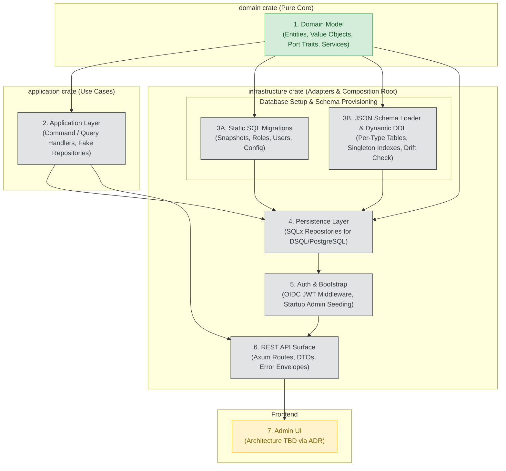

# Implementation Roadmap

This document outlines the end-to-end implementation plan for Luminair following the completion of the `domain` crate. It defines the sequence of milestones, layer boundaries, architectural dependencies, and testing strategies.

---

## Architecture & Dependency Flow

---

## Phase Breakdown

### Phase 1: Domain Crate (Completed ✅)
* **Scope**: All domain entities, value objects with `nutype`, pure domain services (`SchemaRegistry`, `AuthorizationService`), and async port traits (`Send + Sync`).
* **Deliverable**: `domain` crate with 64 passing unit tests, zero warnings.
* **Reference**: [`docs/plans/domain-model-implementation.md`](./plans/domain-model-implementation.md).

---

### Phase 2: Application Layer (Use Cases & Workflows)
* **Crate**: `application`
* **Objective**: Orchestrate business use cases, command and query handling, and transactional logic independently of databases or HTTP frameworks.
* **Key Components**:
  * **Document Workflows**:
    * `CreateDocumentInstanceCommand`: Validates input with `SchemaRegistry`, checks singleton constraint for `SingleType`, generates v7 UUID, saves via repository.
    * `UpdateDocumentInstanceCommand`: Bumps version and audit trail, validates fields.
    * `PublishDocumentInstanceCommand`: Advances revision, snapshots fields, records publication.
    * `UnpublishDocumentInstanceCommand`: Transitions document to draft state preserving last published revision.
    * `GetDocumentInstanceQuery`, `ListDocumentInstancesQuery`, `DeleteDocumentInstanceCommand`.
  * **Access & Authorization Workflows**:
    * `SubmitAccessRequestCommand`: Creates pending request for OIDC user.
    * `ApproveAccessRequestCommand`: Grants assigned roles, creates `UserRoleAssignment` records.
    * `RejectAccessRequestCommand`: Sets rejected status with audit notes.
    * `ListAccessRequestsQuery`.
  * **System Configuration**:
    * `GetSystemConfigQuery`, `UpdateSystemConfigCommand`.
* **Testing Strategy**: 100% in-memory unit tests using in-memory fake repositories (`FakeDocumentInstanceRepository`, `FakeAccessRequestRepository`, etc.) per `.ai/skills/testing.md`.

---

### Phase 3: Database Migrations & Schema Loader

Consists of two complementary mechanisms aligned with [ADR-006](./adr/ADR-006-schema-loading.md) and [ADR-007](./adr/ADR-007-persistence-model.md):

#### 3A. Static SQL Migrations (`infrastructure/migrations/`)
* **Objective**: Versioned schema for all non-dynamic system tables using `sqlx migrate`.
* **Tables**:
  * `document_snapshots`: Immutable JSONB revision store.
  * `system_config`: System-level locales and default locale.
  * `roles`, `role_permissions`: Role definitions and permission grants.
  * `user_role_assignments`: OIDC `sub` (`user_id`) to role mapping.
  * `access_requests`: User onboarding and access requests.
  * `shadow_users`: Local cache of verified OIDC identities.

#### 3B. JSON Schema Loader & Dynamic DDL (`infrastructure/src/schema_loader/`)
* **Objective**: Startup synchronization of document schemas from JSON files to in-memory `SchemaRegistry` and physical database tables.
* **Workflow**:
  1. Parse files in `schema/document-types/*.json` and `schema/relations/*.json`.
  2. Validate constraints, reserved attribute names, and relation pairings.
  3. Construct and cache `Arc<SchemaRegistry>` in application state.
  4. Generate and run `CREATE TABLE IF NOT EXISTS {plural_name}` DDL statements.
  5. Apply singleton index for `SingleType` schemas: `_singleton BOOLEAN NOT NULL DEFAULT TRUE CHECK (_singleton = TRUE)` with a unique index.
  6. Inspect `information_schema.columns` to detect drift (missing columns in DB).

---

### Phase 4: Persistence Layer (`infrastructure/src/repositories/`)
* **Crate**: `infrastructure`
* **Objective**: Provide concrete PostgreSQL and AWS DSQL implementations of the repository port traits defined in `domain::ports`.
* **Key Implementations**:
  * `SqlxDocumentInstanceRepository`:
    * Constructs dynamic SQL queries targeting the per-type table `{plural_name}` resolved from `SchemaRegistry`.
    * Serializes/deserializes inline JSONB fields (`LocalizedText`, `Json`).
    * Implements pagination (`Page<T>`) and field filtering.
  * `SqlxSnapshotRepository`: Queries and appends to `document_snapshots`.
  * `SqlxSystemConfigRepository`: Loads and updates the singleton `system_config` row.
  * `SqlxRoleRepository`, `SqlxUserRoleAssignmentRepository`, `SqlxAccessRequestRepository`.
* **Testing Strategy**: Real database integration tests using `#[sqlx::test]` against PostgreSQL test instances.

---

### Phase 5: Authentication, Security & Bootstrap (`infrastructure/src/auth/`)
* **Crate**: `infrastructure`
* **Objective**: Authenticate incoming requests and manage initial administrative access per [ADR-005](./adr/ADR-005-auth-strategy.md).
* **Key Components**:
  * **OIDC / JWT Validator Middleware**:
    * Verifies Bearer tokens via provider JWKS (Cognito / Keycloak / Google).
    * Extracts token claims: `sub` as `UserId`, `email`, `name`.
    * Upserts identity into `shadow_users` table.
  * **Authorization Extractor**:
    * Fetches assigned roles from `UserRoleAssignmentRepository`.
    * Injects authenticated user context and roles into request handlers.
  * **Startup Bootstrap Hook**:
    * Reads `BOOTSTRAP_ADMIN_SUB` from environment.
    * If configured and no admin assignment exists, idempotently assigns the administrator role with `granted_by: None`.

---

### Phase 6: REST API (`infrastructure/src/api/`)
* **Crate**: `infrastructure`
* **Objective**: Expose HTTP endpoints adhering to [`docs/api.md`](./api.md).
* **Key Endpoints**:
  * `/api/{plural_name}`: CRUD operations for document instances (filtered by permissions).
  * `/api/{plural_name}/{id}/publish`: Publish workflow endpoint.
  * `/api/{plural_name}/{id}/unpublish`: Unpublish workflow endpoint.
  * `/api/{plural_name}/{id}/snapshots`: Revision history.
  * `/api/access-requests`: Submit, review, and approve access requests.
  * `/api/schema/document-types`: Read-only introspection of active schema types.
* **Standard Infrastructure**:
  * Request validation via `validator`.
  * Uniform response envelope `{ "data": ..., "meta": ... }`.
  * Standardized error handling returning `application/problem+json`.
* **Testing Strategy**: End-to-end API tests using `axum-test` / `TestServer`.

---

### Phase 7: UI Layer (Admin Dashboard)
* **Objective**: Web-based administration panel for managing content, reviewing access requests, and inspecting schemas.
* **Current Status**: **TBD** per [`docs/architecture.md`](./architecture.md#ui-tbd).
* **Decision Path**:
  1. Draft investigation note on frontend options:
     * *Option A*: Decoupled SPA (React / TypeScript / Tailwind) deployed to S3 / CloudFront.
     * *Option B*: Fullstack Rust (Leptos / Yew) or Server-Side Rendering (HTMX / Askama).
  2. Review trade-offs (deployment simplicity vs developer ergonomics vs AWS serverless cost).
  3. Formulate and accept **ADR-008: UI Architecture**.
  4. Implement UI based on accepted ADR.

---

## Recommended Execution Order

| Step | Milestone | Output | Primary Verification |
|---|---|---|---|
| **1** | Application Layer | Use cases, command/query handlers | Unit tests with in-memory repositories |
| **2** | Static Migrations | `infrastructure/migrations/*.sql` | `sqlx migrate run` |
| **3** | Schema Loader & DDL | JSON parser, DDL generator, drift check | Unit tests with mock JSON schemas |
| **4** | SQLx Repositories | Concrete repository adapters | `#[sqlx::test]` integration tests |
| **5** | Auth & Bootstrap | JWT middleware, admin bootstrap hook | Integration tests with mock tokens |
| **6** | REST API Handlers | Axum router, controllers, problem+json | `axum-test` HTTP test suite |
| **7** | UI Architecture | ADR-008 + dashboard implementation | E2E browser / cypress tests |
