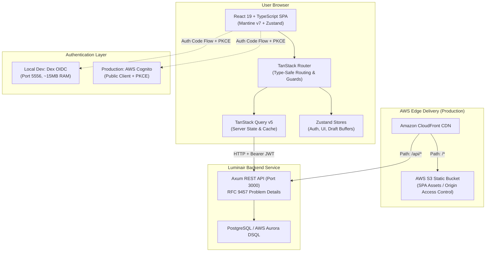
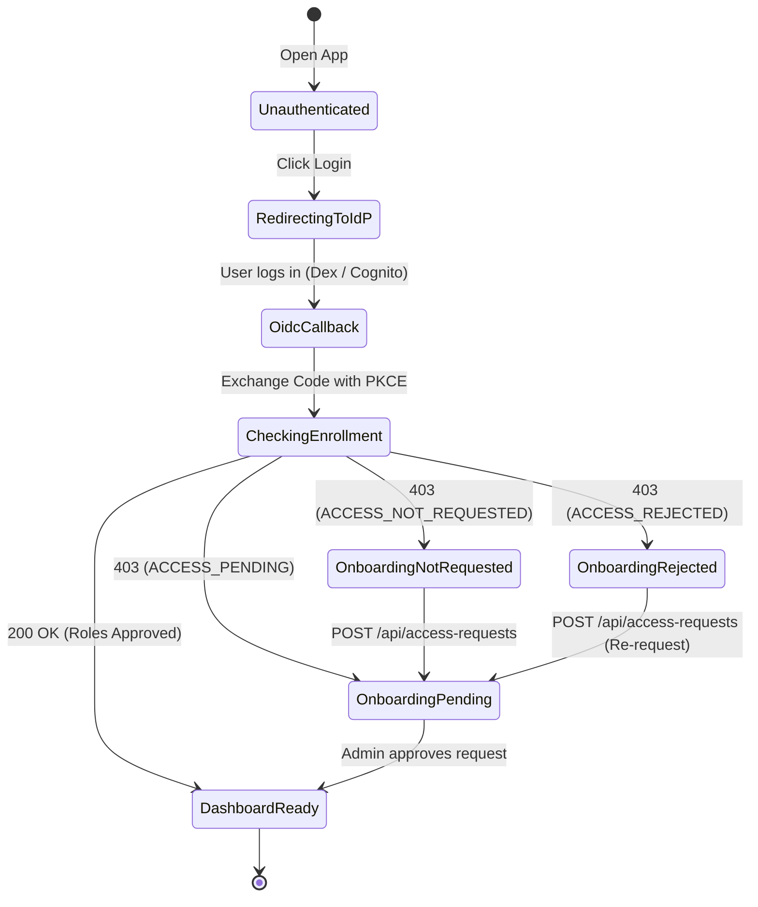

# UI Architecture Specification: Luminair Admin Dashboard

- **Status**: Accepted (Reference Specification)
- **Date**: 2026-09-25
- **Related ADR**: [ADR-010: Admin Dashboard UI Architecture](./adr/ADR-010-ui-architecture.md)

---

## 1. Overview & Architecture

The Luminair Admin Dashboard is a modern, responsive Single-Page Application (SPA) providing content authors, editors, and administrators with an intuitive interface to manage dynamic schema-driven documents, publication lifecycles, relational associations, and user access requests.



---

## 2. Technology Stack & Core Packages

| Area | Package | Version | Purpose |
|---|---|---|---|
| **Core Framework** | `react`, `react-dom` | `^19.0.0` | UI component runtime |
| **Language** | `typescript` | `^5.8.0` | Strict static type checking |
| **Bundler & Tooling** | `vite` | `^6.2.0` | Build tool, dev server, and HMR |
| **Design System** | `@mantine/core` | `^7.16.0` | Accessible UI component primitives |
| **UI Utilities & Hooks** | `@mantine/hooks` | `^7.16.0` | Keyboard, clipboard, responsive layout hooks |
| **Form Management** | `@mantine/form` | `^7.16.0` | Type-safe form handling and validation |
| **Notifications & Toasts** | `@mantine/notifications` | `^7.16.0` | System alerts and problem-details toasts |
| **Modals Manager** | `@mantine/modals` | `^7.16.0` | Dynamic confirm dialogs & relation pickers |
| **Date & Time Controls** | `@mantine/dates`, `dayjs` | `^7.16.0` | Date and DateTime pickers |
| **Rich Text Editor** | `@mantine/tiptap`, `@tiptap/react` | `^7.16.0` | WYSIWYG & rich markdown editing |
| **Iconography** | `@tabler/icons-react` | `^3.30.0` | Comprehensive SVG icon suite |
| **Routing** | `@tanstack/react-router` | `^1.110.0` | 100% type-safe routing & search params |
| **Server State & Cache** | `@tanstack/react-query` | `^5.66.0` | Data fetching, caching, and mutation orchestration |
| **Global Client State** | `zustand` | `^5.0.3` | Lightweight auth, layout, and draft state |
| **HTTP Client** | `axios` | `^1.7.9` | Request/response interceptors & error mapping |
| **Authentication** | `oidc-client-ts` | `^3.1.0` | OIDC Authorization Code Flow with PKCE |
| **Validation Schemas** | `zod` | `^3.24.2` | Runtime schema validation for query parameters |

---

## 3. Directory Layout (`frontend/`)

```
frontend/
├── index.html
├── package.json
├── tsconfig.json
├── tsconfig.node.json
├── vite.config.ts
├── .env.development
├── .env.production
└── src/
    ├── main.tsx                         # Composition Root: Providers & Mount
    ├── App.tsx                          # App Entrypoint
    ├── theme.ts                         # Mantine custom theme configuration
    ├── api/                             # Backend API client & query definitions
    │   ├── client.ts                    # Axios instance with Bearer interceptors
    │   ├── errors.ts                    # RFC 9457 ProblemDetails error types
    │   ├── query-keys.ts                # Centralized TanStack Query cache keys
    │   ├── schema.api.ts                # /api/schema/document-types hooks
    │   ├── documents.api.ts             # /api/{type} CRUD & publish hooks
    │   ├── access-requests.api.ts       # /api/access-requests hooks
    │   └── system.api.ts                # /api/system/config and health hooks
    ├── auth/                            # OIDC PKCE and session handling
    │   ├── oidc-config.ts               # UserManager configuration (Dex / Cognito)
    │   ├── auth-service.ts              # Login, logout, token refresh actions
    │   ├── use-auth-store.ts            # Zustand store for user claims & tokens
    │   └── AuthGuard.tsx                # Route protector and onboarding director
    ├── components/                      # UI components
    │   ├── layout/                      # Application shell components
    │   │   ├── AppHeader.tsx            # Navigation bar, user profile, theme toggle
    │   │   ├── AppSidebar.tsx           # Dynamic content-type navigation menu
    │   │   ├── BreadcrumbBar.tsx        # Hierarchical navigation breadcrumbs
    │   │   └── AppShellLayout.tsx       # Mantine AppShell wrapper
    │   ├── common/                      # Reusable generic widgets
    │   │   ├── DataTable.tsx            # Generic TanStack/Mantine table
    │   │   ├── StatusBadge.tsx          # Draft / Published / Modified indicators
    │   │   ├── ConfirmModal.tsx         # Reusable deletion/action modal
    │   │   └── ErrorAlert.tsx           # ProblemDetails error message banner
    │   └── dynamic-form/                # Schema-Driven Form Generation Engine
    │       ├── DynamicForm.tsx          # Dynamic form root component
    │       ├── DynamicField.tsx         # Attribute type dispatcher
    │       ├── fields/                  # Specialized field input controls
    │       │   ├── TextInputControl.tsx # Text & Uid inputs
    │       │   ├── LocalizedTextTabs.tsx# Multi-locale tabbed inputs
    │       │   ├── NumberInputControl.tsx# Integer & Decimal inputs
    │       │   ├── DateTimeControl.tsx # Date & DateTime pickers
    │       │   ├── BooleanControl.tsx   # Switch / Checkbox
    │       │   ├── EmailUrlControl.tsx  # Validated Email and Url inputs
    │       │   ├── JsonEditorControl.tsx# Code/JSON editor with syntax check
    │       │   └── RelationPickerModal.tsx# Association search modal (HasOne/HasMany)
    ├── routes/                          # TanStack Router route definitions
    │   ├── __root.tsx                   # Root layout with providers & shell
    │   ├── index.tsx                    # Dashboard home / summary metrics
    │   ├── login.tsx                    # Redirect to OIDC provider
    │   ├── callback.tsx                 # OIDC PKCE redirect landing page
    │   ├── onboarding.tsx               # Access request pending/submit page
    │   ├── content/
    │   │   ├── $typeId/
    │   │   │   ├── index.tsx            # Collection items paginated list
    │   │   │   ├── new.tsx              # Create collection item
    │   │   │   └── $instanceId.tsx      # Edit collection item & publish controls
    │   │   └── singleton/
    │   │       └── $typeId.tsx          # Singleton direct edit view
    │   ├── schema/
    │   │   └── index.tsx                # Read-only schema inspector
    │   └── admin/
    │       └── access-requests.tsx      # Access request review & approval panel
    └── store/                           # Zustand persistent client stores
        ├── use-ui-store.ts              # Sidebar collapsed, color scheme, active locale
        └── use-draft-store.ts           # In-memory unsaved form state buffer
```

---

## 4. State Architecture

State is cleanly partitioned into **Server State** (managed by TanStack Query) and **Client/UI State** (managed by Zustand).

### 4.1 Server State: TanStack Query v5

All remote data fetched from the Axum REST API is cached and managed via `@tanstack/react-query`:
- **Query Keys**: Structured hierarchical tuples:
  - `['schema', 'types']` $\rightarrow$ list of all `DocumentType`s.
  - `['schema', 'types', typeId]` $\rightarrow$ single `DocumentType` metadata.
  - `['documents', typeId, { page, pageSize, filter }]` $\rightarrow$ paginated collection items.
  - `['documents', typeId, instanceId]` $\rightarrow$ single document instance.
  - `['access-requests', 'pending']` $\rightarrow$ pending access requests.
- **Mutations & Cache Invalidation**:
  - `publishDocumentMutation`: Optimistically updates document badge, invalidates `['documents', typeId]`.
  - `deleteDocumentMutation`: Invalidates `['documents', typeId]`.
  - `approveAccessRequestMutation`: Invalidates `['access-requests', 'pending']`.

### 4.2 Client State: Zustand Stores

Zustand provides lightweight, unopinionated stores with zero boilerplate:

#### 1. `useAuthStore`
```typescript
interface AuthState {
  user: {
    sub: string;
    email?: string;
    name?: string;
  } | null;
  accessToken: string | null;
  idToken: string | null;
  roles: string[];
  isAuthenticated: boolean;
  onboardingStatus: 'not_requested' | 'pending' | 'rejected' | 'approved' | null;
  setSession: (tokens: { access_token: string; id_token?: string }, claims: any) => void;
  setOnboardingStatus: (status: AuthState['onboardingStatus']) => void;
  clearSession: () => void;
}
```

#### 2. `useUiStore` (with `persist` middleware)
```typescript
interface UiState {
  sidebarCollapsed: boolean;
  toggleSidebar: () => void;
  colorScheme: 'light' | 'dark' | 'auto';
  setColorScheme: (scheme: 'light' | 'dark' | 'auto') => void;
  activeLocale: string; // e.g. "en" or "uk"
  setActiveLocale: (locale: string) => void;
}
```

---

## 5. Dynamic Schema-Driven Form Engine

The core innovation of the Luminair UI is its ability to render rich, interactive forms dynamically from the metadata returned by `GET /api/schema/document-types/{id}` without requiring code generation or hardcoded templates.

### Field Type Mapping

| Domain `FieldType` | Backend JSON Representation | Mantine v7 Control | Specific Features & Validation |
|---|---|---|---|
| `Text` | `{"type": "text"}` | `TextInput` / `Textarea` | Character counter, `min`/`max` constraints |
| `LocalizedText` | `{"type": "localizedText"}` | `Tabs` containing `TextInput` / `Textarea` | Dynamically renders a tab per configured locale in `SystemConfig`. Flags uncompleted locales |
| `Uid` | `{"type": "uid"}` | `TextInput` with slugify button | Auto-generates slug from a designated title field |
| `Uuid` | `{"type": "uuid"}` | `TextInput` (readonly or disabled) | Display-only or UUID v7 generator |
| `Integer` | `{"type": "integer", "size": "i32"}` | `NumberInput` | `min`, `max`, `step={1}`, integer formatting |
| `Decimal` | `{"type": "decimal", "precision": 10, "scale": 2}` | `NumberInput` | Decimal step, exact numeric parsing |
| `Date` | `{"type": "date"}` | `DatePickerInput` | Calendar picker (ISO 8601 `YYYY-MM-DD`) |
| `DateTime` | `{"type": "dateTime"}` | `DateTimePicker` | Date + Time selector (UTC ISO 8601) |
| `Boolean` | `{"type": "boolean"}` | `Switch` | Boolean toggle with clear Yes/No label |
| `Email` | `{"type": "email"}` | `TextInput` with `@` icon | Native email format regex validation |
| `Url` | `{"type": "url"}` | `TextInput` with link icon | URL protocol and hostname validation |
| `Json` | `{"type": "json"}` | Code editor / structured key-value editor | JSON syntax validation, format prettifier |
| `Relation (HasOne)` | `{"type": "relation", "kind": "hasOne"}` | `Select` or `RelationPickerModal` | Searchable combobox linking a single target UUID |
| `Relation (HasMany)`| `{"type": "relation", "kind": "hasMany"}` | `MultiSelect` or `RelationPickerModal`| Tagged list linking multiple target UUIDs |

---

## 6. Authentication & Onboarding Lifecycle



### Route Guard Behavior (`AuthGuard.tsx`)
1. If `!isAuthenticated` $\rightarrow$ redirects to `/login`.
2. Calls `GET /api/schema/document-types`.
3. If error is `403` with Problem Details `https://luminair.dev/errors/access-not-requested` $\rightarrow$ renders Onboarding Submission screen.
4. If error is `403` with `access-pending` $\rightarrow$ renders Pending Approval notification with an auto-poll timer.
5. If error is `403` with `access-rejected` $\rightarrow$ displays rejection notice with re-submit button.
6. If `200 OK` $\rightarrow$ renders the requested dashboard route.

---

## 7. Local Development Setup with Dex

To ensure instant, low-memory local development without Keycloak's JVM overhead, Dex runs via Docker Compose alongside PostgreSQL.

### 7.1 `docker-compose.dev.yml`
```yaml
version: '3.8'

services:
  postgres:
    image: postgres:16-alpine
    container_name: luminair-postgres
    restart: unless-stopped
    environment:
      POSTGRES_USER: luminair
      POSTGRES_PASSWORD: luminair_password
      POSTGRES_DB: luminair_db
    ports:
      - "5432:5432"
    volumes:
      - pgdata:/var/lib/postgresql/data

  dex:
    image: ghcr.io/dexidp/dex:v2.41.1
    container_name: luminair-dex
    restart: unless-stopped
    ports:
      - "5556:5556"
    volumes:
      - ./docker/dex/dex-config.yaml:/etc/dex/config.docker.yaml
    depends_on:
      - postgres

volumes:
  pgdata:
```

### 7.2 `docker/dex/dex-config.yaml`
```yaml
issuer: http://localhost:5556/dex
storage:
  type: memory

web:
  http: 0.0.0.0:5556

# Pre-seeded local users
staticPasswords:
  # Password for all mock accounts: "password"
  - email: "admin@luminair.dev"
    hash: "$2a$10$2b2cU8CPhOTaGrs1HRQuAueS7JTT5ZHsHSzYiFPm1leZck7Mc8T4W"
    username: "admin"
    userID: "08a1d7f3-admin-sub"

  - email: "editor@luminair.dev"
    hash: "$2a$10$2b2cU8CPhOTaGrs1HRQuAueS7JTT5ZHsHSzYiFPm1leZck7Mc8T4W"
    username: "editor"
    userID: "08a1d7f3-editor-sub"

# Pre-configured public client for Vite SPA
staticClients:
  - id: luminair-admin-spa
    name: "Luminair Admin Dashboard"
    public: true
    redirectURIs:
      - "http://localhost:5173/callback"
```

### 7.3 Frontend `.env.development`
```bash
VITE_API_BASE_URL="/api"
VITE_OIDC_AUTHORITY="http://localhost:5556/dex"
VITE_OIDC_CLIENT_ID="luminair-admin-spa"
VITE_OIDC_REDIRECT_URI="http://localhost:5173/callback"
VITE_OIDC_SCOPE="openid email profile"
```

### 7.4 Vite Dev Proxy (`vite.config.ts`)
```typescript
import { defineConfig } from 'vite';
import react from '@vitejs/plugin-react';

export default defineConfig({
  plugins: [react()],
  server: {
    port: 5173,
    proxy: {
      '/api': {
        target: 'http://localhost:3000',
        changeOrigin: true,
      },
    },
  },
});
```

---

## 8. Production Deployment on AWS

```
                            ┌───────────────────────────────────┐
                            │       AWS Amazon CloudFront       │
                            │     (https://cms.example.com)     │
                            └─────────────────┬─────────────────┘
                                              │
                    Path: /*                  │             Path: /api/*
           ┌──────────────────────────────────┴──────────────────────────────────┐
           ▼                                                                     ▼
┌───────────────────────────┐                                       ┌───────────────────────────┐
│       AWS S3 Bucket       │                                       │   Axum Backend Service    │
│  (Origin Access Control)  │                                       │  (ECS Fargate / ALB / APG)│
│  Mantine SPA Static Dist  │                                       │  REST API                 │
└───────────────────────────┘                                       └───────────────────────────┘
```

1. **S3 Static Bucket**:
   - Holds pre-built production bundle (`frontend/dist/`).
   - Private bucket, completely blocked from public internet access.
2. **CloudFront Distribution**:
   - Accesses S3 via **Origin Access Control (OAC)**.
   - Default Cache Behavior (`/*`): Cached at global CloudFront edge locations with gzip/brotli compression. Custom error response: `404` rewrites to `/index.html` with status `200` to support client-side routing.
   - API Behavior (`/api/*`): Forwards directly to Axum ALB/ECS origin with caching disabled (`Cache-Control: no-cache, no-store`).
3. **Zero CORS**: Because both assets and API share the exact same domain name (`cms.example.com`), browsers make direct requests without CORS preflight overhead.
